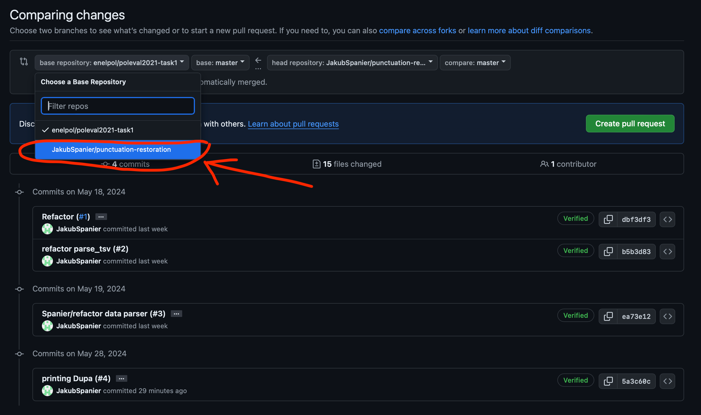

# Punctuation Restoration Project

## Description

The project comes from POLEVAL 2021 contest, the [task 1](http://2021.poleval.pl/tasks/task1). We're trying here to replicate the solution provided by @djstrong, mostly for educational purposes. This is a fork from his project.

## Authors

- Filip Iwanowski
- Magdalena Rojek
- Jakub Spanier

### Git workflow

1. Checkout the *master* branch and pull the newest version
```commandline
git checkout master
git pull
```
2. Create your branch with a template *your_surname/branch_name* e.g. *kowalski/adding-spacy-tokenization*
```commandline
git checkout -b "your_surname/branch_name"
```
3. Add your changes
4. Format your changes with ruff
```commandline
ruff format
```
5. Save them
```commandline
git add .
git commit -m "my changes message"
```
6. Push your changes to the repository
```commandline
git push -u origin "your_surname/branch_name"
```
7. Create the Pull Request in the GitHub. REMEMBER to choose correct base repository

8. Let your collaborators know about your PR

